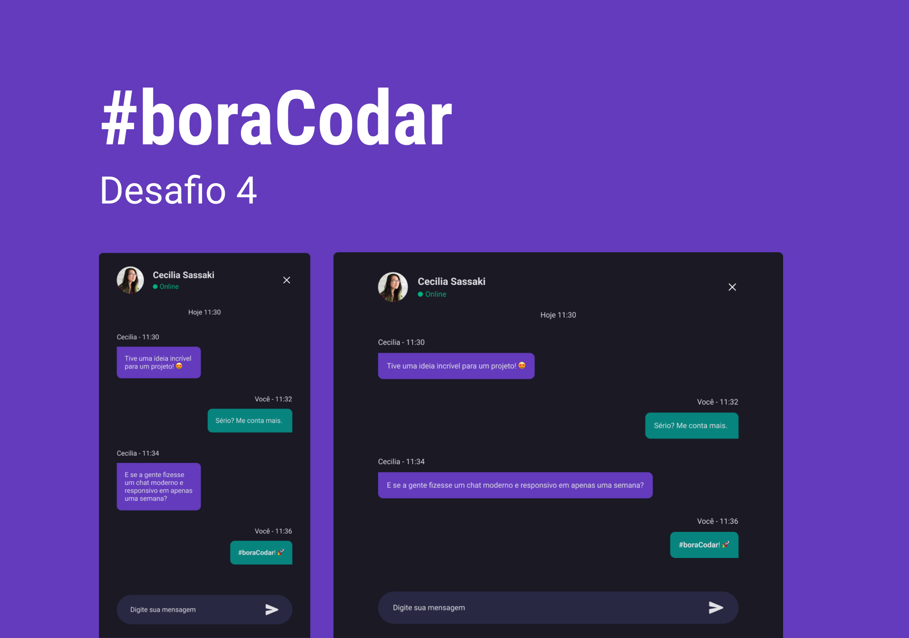

# Projeto Web Chat

## 💻 _Description_

Repositório criado para armazenar o Desafio 04 #BoraCodar proposto pela comunidade Rocketseat.

## 💻  Projeto desenvolvido

## 💡  Info

O app contém um chat sofisticado com interface moderna e responsiva perfeito para você conversar com seus amigos!

## 💻 Tecnologias/Pacotes utilizados

**Frontend**
- ReactJS
- TypeScript
- NextJs
- Sass
- PhosphorReact

## 👨‍💻 Autor

Gabriel Dias Catarin, desenvolvedor web | Bauru, São Paulo

[ LinkedIn](https://www.linkedin.com/in/gabriel-dias-260857207/)
&nbsp;
